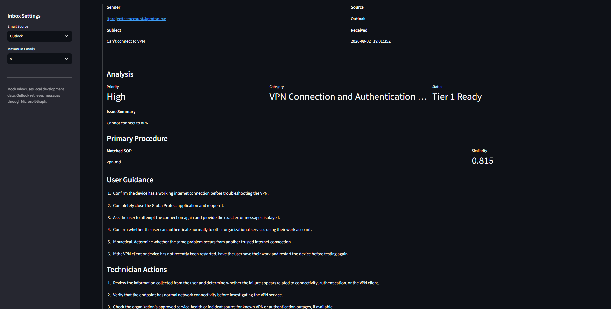

# AI IT Support Assistant

A local AI-assisted Tier 1 IT support project that reads support emails, retrieves relevant troubleshooting procedures, analyzes tickets with a local LLM, and presents the results in a Streamlit dashboard.

I built this project to explore how AI could fit into a realistic IT support workflow without allowing the model to freely invent troubleshooting procedures. The current design uses a small knowledge base of IT support SOPs as its source of truth and routes unsupported or sensitive cases for human review.

## What It Does

The application can:

- Retrieve support emails from Outlook using Microsoft Graph
- Use mock email data for local development and testing
- Convert incoming emails into support tickets
- Search a local SOP knowledge base using semantic similarity
- Determine whether the issue is covered by the available documentation
- Load the full matched SOP for analysis
- Generate structured Tier 1 troubleshooting guidance with a local LLM
- Separate user-safe troubleshooting from technician actions
- Apply deterministic policy rules after AI analysis
- Route unsupported or security-related tickets for human review
- Display processed tickets and retrieval information in a Streamlit dashboard

## Current Workflow

```text
Outlook / Mock Inbox
        |
        v
   Ticket Creation
        |
        v
Semantic SOP Retrieval
        |
        v
 Retrieval Threshold
    /          \
No Match     Match
   |            |
Human Review    v
          Load Full SOP
                |
                v
          Local LLM Analysis
                |
                v
          Policy Enforcement
                |
                v
       Streamlit Dashboard
```

Retrieval is performed against smaller SOP sections. The highest-scoring result is used to identify the most relevant procedure.

If the similarity score is below the configured threshold, the system does not attempt to adapt an unrelated procedure. The ticket is marked for human review instead.

When a valid match is found, the application loads the complete source SOP before sending the ticket and documentation to the LLM. This allows retrieval to stay focused while giving the model the full troubleshooting procedure when generating its analysis.

## Example Dashboard

The Streamlit interface provides a ticket queue and detailed analysis for each processed message.

It displays:

- Sender and subject
- Email source and received time
- Priority
- Issue category
- Issue summary
- Matched SOP
- Retrieval similarity
- User-safe troubleshooting steps
- Technician actions
- Routing decision
- Original email
- Retrieval details for troubleshooting/debugging



## Knowledge Base

The current knowledge base contains procedures for:

- VPN connection and authentication issues
- Password resets and account lockouts
- Windows printer issues
- Suspicious or phishing emails
- Windows workstation performance issues

The SOPs include issue scope, information to collect, user-safe troubleshooting, technician actions, escalation conditions, and resolution criteria.

The knowledge base is intentionally limited. An unsupported issue should be identified as unsupported rather than forcing a match to the closest available document.

## RAG and Scope Detection

SOPs are split into sections and converted into embeddings using Ollama.

For an incoming ticket, the retriever:

1. Creates an embedding for the ticket.
2. Compares it with indexed SOP sections using cosine similarity.
3. Ranks the most relevant sections.
4. Checks the highest score against a minimum retrieval threshold.
5. Identifies the source SOP when the threshold is met.
6. Loads the complete SOP for ticket analysis.

The current minimum retrieval score is:

```python
MIN_RETRIEVAL_SCORE = 0.45
```

This was added after testing showed that unrelated issues could still retrieve superficially similar documentation.

For example, issues involving webcams, Bluetooth headsets, monitors, USB devices, and other unsupported topics should be rejected rather than receiving troubleshooting instructions from an unrelated SOP.

## Testing

The project includes retrieval, scope-detection, security, and adversarial tests.

The scope-detection test currently contains both supported and unsupported requests.

Current test set:

```text
20 scope-detection cases
10 supported
10 unsupported
```

The latest run correctly classified all 20 test cases, including selecting the expected SOP for supported issues and rejecting the unsupported cases.

This test set is small and purpose-built for the current knowledge base, so the result should not be interpreted as general IT support accuracy.

Run the retrieval tests with:

```powershell
python -m tests.test_retrieval
```

Run the scope-detection tests with:

```powershell
python -m tests.test_scope_detection
```

## Outlook Integration

The project can retrieve messages from a test Outlook mailbox through Microsoft Graph.

Authentication uses MSAL and Microsoft's device authorization flow. The Outlook integration is kept separate from the ticket analysis pipeline so the same processing logic can also be tested with local mock messages.

The Streamlit dashboard can switch between:

- Mock Inbox
- Outlook

This lets the AI/RAG pipeline be developed without requiring a live mailbox for every test.

## Safety and Human Review

The LLM is not treated as the final authority for routing.

The project includes deterministic policy logic that runs after AI analysis. For example, security-related tickets can be forced into human review even when the model does not request escalation.

The analysis prompt also instructs the model to:

- Use the supplied SOP as its source of truth
- Avoid inventing company procedures
- Keep privileged actions separate from user-safe steps
- Never request passwords, MFA codes, or authentication secrets
- Avoid assuming escalation criteria are satisfied without evidence
- Send inadequately documented issues to human review

This creates a basic separation between probabilistic AI analysis and application-enforced rules.

## Project Structure

```text
ai-it-support-lab/
|
├── data/
│   ├── mock_emails.json
│   └── sample_tickets.json
|
├── knowledge_base/
│   ├── password_reset.md
│   ├── phishing.md
│   ├── printer.md
│   ├── vpn.md
│   └── windows_performance.md
|
├── rag/
│   ├── __init__.py
│   ├── ingest_sops.py
│   ├── knowledge_index.json
│   └── retriever.py
|
├── tests/
│   ├── adversarial_tests.py
│   ├── security_tests.py
│   ├── test_retrieval.py
│   └── test_scope_detection.py
|
├── ai_analyzer.py
├── app.py
├── dashboard.py
├── email_reader.py
├── graph_auth.py
├── outlook_reader.py
├── policy.py
├── process_inbox.py
├── test_outlook.py
├── ticket_processor.py
├── requirements.txt
└── README.md
```

`knowledge_index.json` is generated from the SOPs and can be excluded from version control if the index is rebuilt locally.

## Running the Project

### 1. Create and activate a virtual environment

```powershell
python -m venv .venv
.venv\Scripts\Activate.ps1
```

### 2. Install dependencies

```powershell
pip install -r requirements.txt
```

### 3. Make sure Ollama is running

The project currently uses Ollama for local embeddings and LLM inference.

### 4. Build the SOP index

```powershell
python rag/ingest_sops.py
```

### 5. Run the tests

```powershell
python -m tests.test_retrieval
python -m tests.test_scope_detection
```

### 6. Start the dashboard

```powershell
streamlit run dashboard.py
```

Outlook mode additionally requires a Microsoft Entra application configured for the Microsoft Graph permissions used by the project.

## Why I Built It

I wanted this project to go beyond sending an IT ticket directly to an LLM and displaying whatever it returned.

While building it, I ran into several problems that changed the design:

- Unrelated SOPs could still receive non-zero similarity scores.
- Giving the model only retrieved fragments could remove important troubleshooting context.
- Giving the model escalation criteria did not mean those criteria were actually satisfied.
- AI-generated routing alone was not enough for security-sensitive tickets.
- A system can appear to work on normal examples while behaving poorly on unsupported inputs.

Those issues led me to add retrieval thresholds, explicit unsupported-ticket handling, full-SOP loading after retrieval, deterministic policy enforcement, and separate scope-detection tests.

The project is still a lab rather than a production help desk system, but it now represents a complete working pipeline from email ingestion through retrieval, AI analysis, policy enforcement, and technician-facing presentation.

## Current Status

Working:

- Local SOP ingestion and embeddings
- Semantic retrieval
- Full-SOP loading after retrieval
- Retrieval threshold and unsupported-ticket detection
- Structured local LLM analysis
- User/technician action separation
- Policy-based human review
- Mock inbox processing
- Microsoft Graph Outlook retrieval
- Streamlit ticket dashboard
- Retrieval and scope-detection tests

Still improving:

- Dashboard presentation and retrieval-detail layout
- Broader SOP coverage
- Additional adversarial and edge-case testing
- Outlook authentication/session handling
- Error handling and logging
- More realistic end-to-end ticket scenarios

## Tech Stack

- Python
- Ollama
- Llama 3
- EmbeddingGemma
- Microsoft Graph API
- MSAL
- Streamlit
- JSON / Markdown